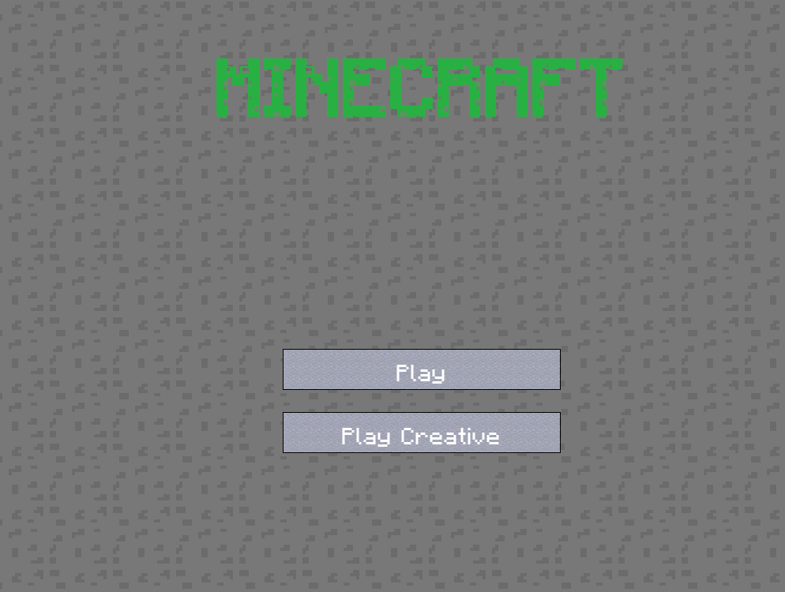
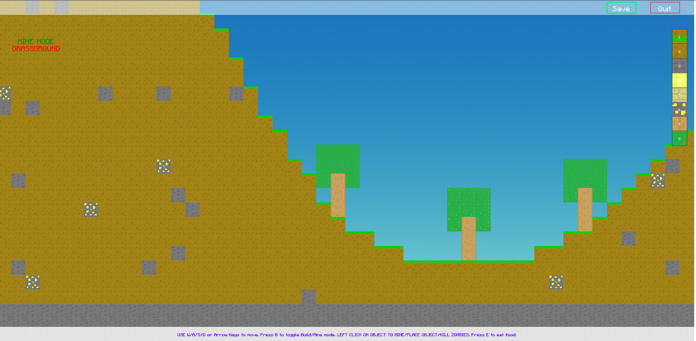
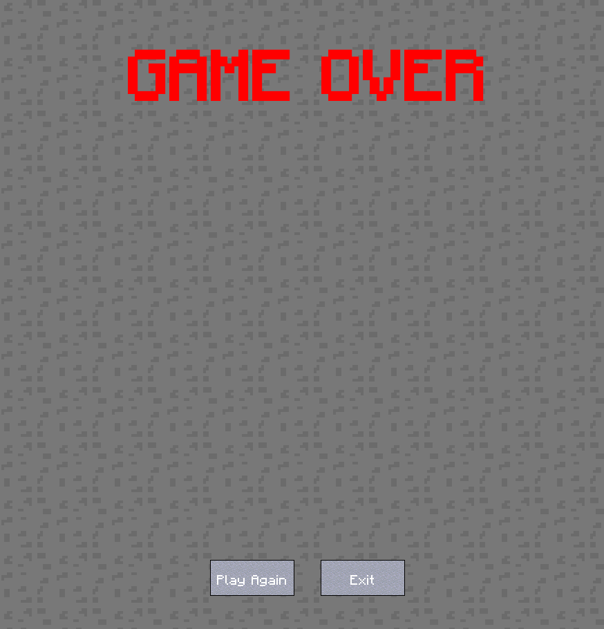

# MINECRAFT 2D

# [Play](https://silwalanish.github.io/minecraft2d/) 

## Screenshots
1. Main Menu Screen 
2. Map Selection Screen 
3. Normal Game Play Screen 
4. Creative Game Play Screen 
5. Game Over Screen 

## Assets
1. Ground Textures: https://opengameart.org/content/2d-minecraft-sprite-pack
2. Steve Textures: https://opengameart.org/content/2d-minecraft-steve
3. Zombie Sprite: https://opengameart.org/content/zombie-character-sprite

Minecraft

  
  
  
  
  
  
  
  
  
  
  
  

Skies

  
  
  
  
  
  
  
  
  
  
  
  
  
  
  
  
  
  

General

  
  
  
  
  
  
  
  
  
  

